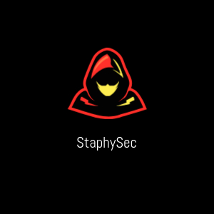

# StaphySec

Welcome, everybody!

### About me

* Nickname: **Staphy**
* Masters Degree:  **Network Engineering and Distributed Systems**.
* I speak English, French, and Arabic.
* I  really enjoy researching,learning, playing CTFs, and purposefully working toward and achieving goals to become better every day.

****
